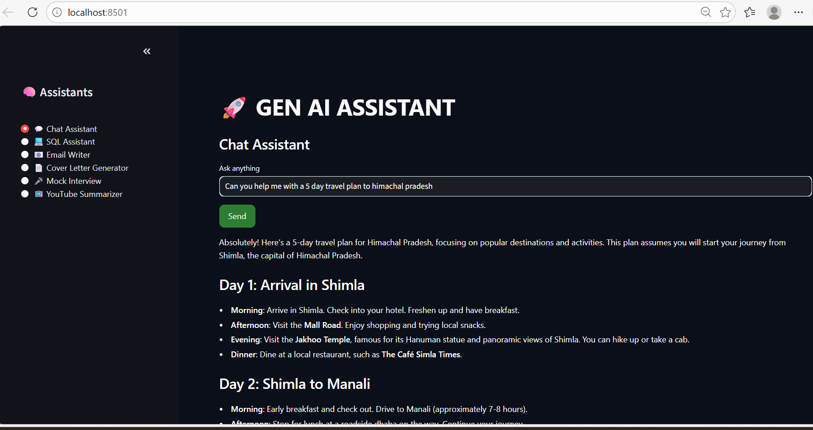
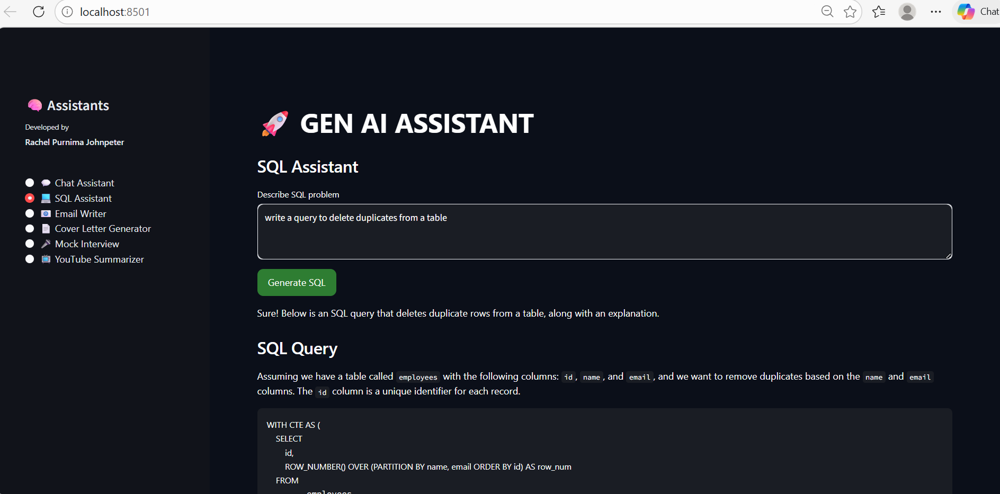
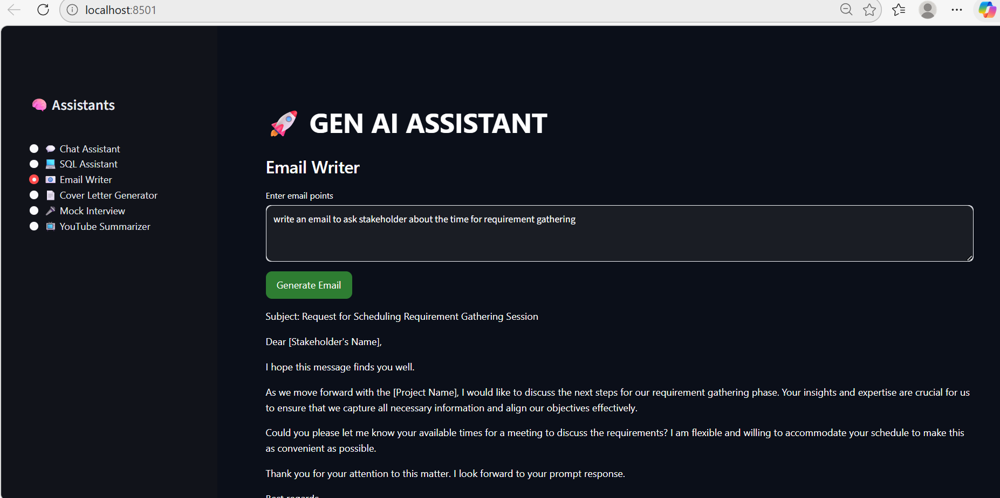
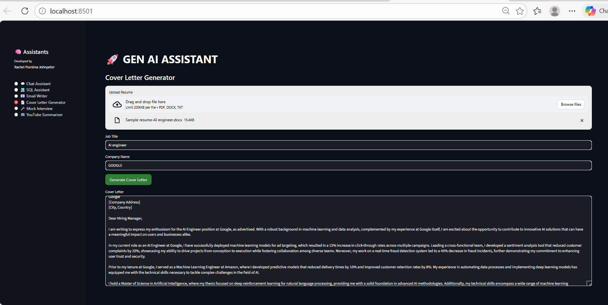
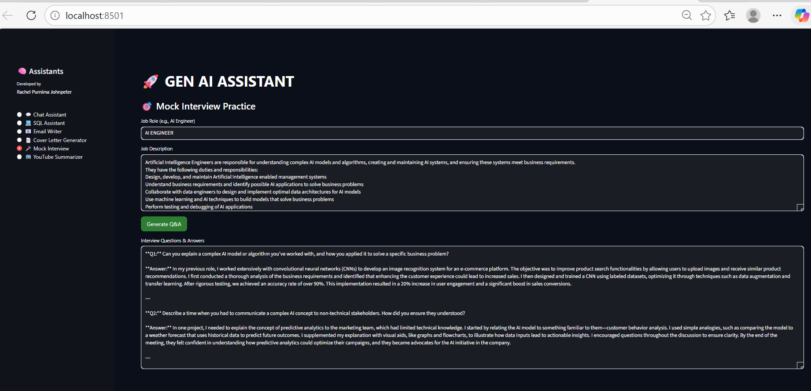
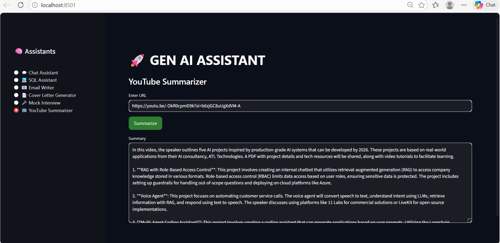

# 🚀 Gen AI Multi-Assistant (LangChain Powered)

A modular, production-style GenAI application built using **Streamlit + LangChain**, featuring multiple AI-powered assistants for real-world use cases.

---

## 📌 Overview

This project demonstrates how to build a **multi-assistant GenAI system** using modern **LangChain (LCEL)** architecture.

Each assistant is designed with:

* Modular structure
* Reusable LLM pipeline
* Prompt-driven workflows
* Clean dark-themed UI

Although this application can be built using direct LLM API calls, it is intentionally implemented using **LangChain** to understand **pipeline-based design and prompt orchestration**.

---

## 🎯 Features

### 💬 Chat Assistant

* General-purpose AI assistant
* Provides clear explanations with examples

---

### 💻 SQL Assistant

* Converts business problems into SQL queries
* Includes query explanation

---

### 📧 Email Writer

* Generates professional emails from bullet points
* Structured output (subject, greeting, body, closing)

---

### 📄 Cover Letter Generator

* Upload resume (PDF / DOCX / TXT)
* Generates tailored cover letter based on role + company

---

### 🎤 Mock Interview Assistant

* Input: Job role + job description
* Output: 5 interview questions + strong answers
* Covers technical + behavioral + scenario-based

---

### 📺 YouTube Summarizer

* Extracts transcript from YouTube videos
* Generates concise summary using LLM

---

## 🧠 Architecture

This project follows a **modular architecture**:

```
GenAI_Multi_Assistant/
│
├── app.py                  # Main Streamlit UI + routing + CSS
├── llm.py                  # Centralized LLM initialization
├── requirements.txt        # Dependencies
├── .env                    # API keys (not committed)
│
├── assistants/             # Individual assistants
│   ├── chat.py
│   ├── sql.py
│   ├── email.py
│   ├── cover_letter.py
│   ├── mock_interview.py
│   └── youtube.py
│
├── utils/                  # Helper utilities
│   └── file_reader.py      # Resume text extraction (PDF/DOCX/TXT)
```

---

## ⚙️ Technologies Used

* **Python**
* **Streamlit** (UI framework)
* **LangChain (LCEL)**

  * PromptTemplate
  * ChatOpenAI
  * StrOutputParser
* **OpenAI API (gpt-4o-mini)**
* **YouTube Transcript API**
* **PyPDF / python-docx** (file parsing)
* **python-dotenv** (environment management)

---

## 🧪 How LangChain is Used

This project uses **LangChain Expression Language (LCEL)** to build structured pipelines.

Each assistant follows this pattern:

```
PromptTemplate → LLM → OutputParser → invoke()
```

### Example Flow

1. User provides input (text, resume, URL, etc.)
2. `PromptTemplate` injects input into a structured prompt
3. `ChatOpenAI` (LLM) generates response
4. `StrOutputParser` converts output into clean text
5. Result is displayed via Streamlit UI

### Code Pattern Used

```python
chain = prompt | llm | parser
response = chain.invoke({...})
```

---

## 🔍 Key Design Concepts

* **Separation of Concerns**

  * UI → `app.py`
  * Logic → `assistants/`
  * Utilities → `utils/`
  * LLM → `llm.py`

* **Modular Architecture**

  * Each assistant is independent and reusable

* **Context Injection**

  * Resume, job description, transcript used as input context

* **Prompt Engineering**

  * Structured prompts for consistent outputs

---

## 📦 Installation

### 1. Clone Repository

```bash
git clone <your-repo-url>
cd GenAI_Multi_Assistant
```

---

### 2. Create Virtual Environment

```bash
python -m venv genai_env
genai_env\Scripts\activate   # Windows
```

---

### 3. Install Dependencies

```bash
pip install -r requirements.txt
```

---

### 4. Set Environment Variables

Create a `.env` file:

```
OPENAI_API_KEY=your_api_key_here
```

---

### 5. Run Application

```bash
streamlit run app.py
```

---

## 📸 Screenshots

### 💬 Chat Assistant


### 💻 SQL Assistant


### 📧 Email Writer


### 📄 Cover Letter Generator


### 🎤 Mock Interview Assistant


### 📺 YouTube Summarizer


---

## 🎨 UI Highlights

* Custom **dark theme UI** using CSS
* Clean sidebar navigation
* Consistent layout across assistants
* Styled input boxes, buttons, and outputs

---

## 🚀 Key Learnings

* Built multi-assistant GenAI system using LangChain
* Understood **LCEL pipeline (prompt → model → parser)**
* Implemented **modular architecture**
* Integrated external APIs (YouTube transcript)
* Applied prompt engineering for multiple use cases
* Handled real-world Streamlit UI customization

---

## 🔮 Future Enhancements

* Chat memory (conversation history)
* Streaming responses
* RAG-based assistants (vector DB + retrieval)
* Agent-based workflows
* Download/export outputs
* Authentication layer

---

## 👩‍💻 Developed By

**Rachel Purnima Johnpeter**

---

## ⭐ Notes

This project was built as part of learning:

* LangChain (LCEL)
* Generative AI application design
* Multi-assistant architecture

---
